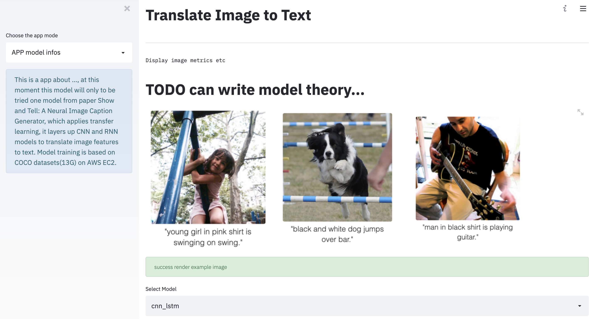

# image_caption_app

This repo is used to build an end to end computer vision app. I did object detection model and trained model are saved as checkpoints, then I use AWS SageMaker as endpoint(URI) to test image sets data stored in AWS S3 bucket, can see <a href="https://github.com/Chloejay/image_caption_app/blob/master/model_api_demo.ipynb">example from ipython file</a>. This time, I will use `Flask` or `Streamlit` as a frontend tool and MLflow to log training versions.

On this repo, I originally planned to use already trained model which I trained one year ago for image detection task, since the purpose for this app is not to get the highest accuracy of model. However, the latest trained `tensorflow` model is not saved on my local machine, so I decide to rebuild a model by using transfer learning. Such as use pre-trained `mmdetection` or `Mask-RCNN`. However, I decided to finish image captioning task(image to text translation), since I started to learn computer vision, I was impressed by Karpathy cs231n course and his <a href="https://github.com/karpathy/neuraltalk">neuraltalk project.</a> Deep Visual-Semantic Alignments for Generating Image Descriptions <a href="https://cs.stanford.edu/people/karpathy/deepimagesent/">website</a>.

The repo is based on paper <i>Show and Tell: A Neural Image Caption Generator</i> <a href="https://arxiv.org/abs/1411.4555">arXiv.</a>
CNN + LSTM 

## The App screenshot 


#### Basic NLP tips:
tokenization, remove punctuation, brackets, stop/rare words etc,word2vector, stemming, lemmatization.

Model Train on AWS EC2
```
ssh -i aws -L localhost:8888:localhost:8888 ubuntu@13.59.137.250
```
Train model based on COCO datasets (datasize: 13G) and show-attend-and-tell-tensorflow repo
```
python main.py --phase=train \
    --load_cnn \
    --cnn_model_file='./vgg16_no_fc.npy'
```
Model Inference 
```
python main.py --phase=test \
    --model_file='./models/xxxx.npy'
```
Tensorboard
```
tensorboard --logdir='./log' --port= 6005
```
UI 
```
streamlit run app.py
```

## automate workflow
- Makefile 

## Setup 
```
pip install -r requirements.txt

setup.py 
pip install -e . 
```

## CI/CD
```
#Use Github Actions.
mkdir -p .github/workflows
cd .github/workflows
touch cml.yaml
```
#### Use git branch to experiment 
```
git checkout -b experiment_v1
git add .
git commit -m""
git push origin experiment_v1
```
## LICENSE 
- [MIT](https://opensource.org/licenses/MIT)
- <s>#auto generate LICENSE doc</s>
- <s>wget -c https://www.gnu.org/licenses/gpl-3.0.txt -O LICENSE</s>

#### Deploy on Heroku 
```
setup.sh #helper file
Procfile #specify the type of application nd command to run it 
```
## Resource
###### TODO
- Im2Text: Describing Images Using 1 Million Captioned Photographs <a href="http://papers.nips.cc/paper/4470-im2text-describing-images-using-1-million-captioned-photographs.pdf">arXiv</a>
- DenseCap: Fully Convolutional Localization Networks for Dense Captioning <a href="https://www.cv-foundation.org/openaccess/content_cvpr_2016/papers/Johnson_DenseCap_Fully_Convolutional_CVPR_2016_paper.pdf">CVPR</a>
- Unifying Visual-Semantic Embeddings with Multimodal Neural Language Models <a href="https://arxiv.org/pdf/1411.2539.pdf">arXiv</a>
- Knowing When to Look: Adaptive Attention via A Visual Sentinel for Image Captioning <a href="https://arxiv.org/pdf/1612.01887.pdf">arXiv</a>
- Microsoft COCO Captions: Data Collection and Evaluation Server <a href="https://arxiv.org/pdf/1504.00325.pdf">arXiv</a>